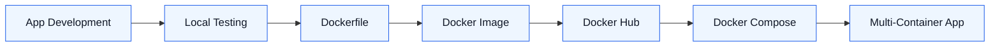
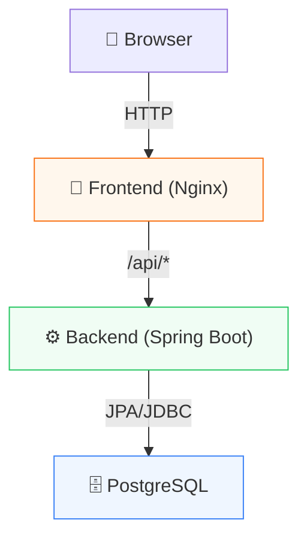
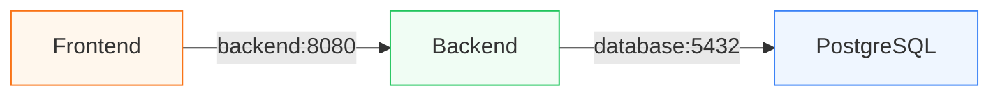

# 👨‍💼 Employee Management Application

<p align="center">
  
  
  
  
</p>

<p align="center">
  <b>A three-tier Employee Management app, built to learn DevOps &amp; Docker</b><br/>
  Created as part of the <b>Zidd 3.0 DevOps Bootcamp</b> by <b>DevOps Jadeja</b>.
</p>

<p align="center">
  
  
  
  
</p>

---

## 📌 Overview

A simple **three-tier Employee Management application**, built primarily as a hands-on **DevOps/Docker learning exercise** rather than a complex product.

| Tier | Stack | Purpose |
|---|---|---|
| 🎨 Frontend | HTML, CSS, JS + Nginx | UI, static files, API reverse proxy |
| ⚙️ Backend | Java 21 + Spring Boot | REST APIs & business logic |
| 🗄️ Database | PostgreSQL | Employee data persistence |

**The journey:** built and tested locally first → containerized only after it worked.



---

## 🧰 Tech Stack

**App:** HTML · CSS · JavaScript · Nginx · Java 21 · Spring Boot (Web, Data JPA) · Hibernate · Maven · PostgreSQL

**DevOps:** Docker · Multi-stage builds · Docker Hub · Docker Compose · `.env` config · Named volumes · Health checks · WSL Ubuntu

---

## 🏗️ Architecture



## ✨ Functionality

Standard **CRUD** for employees — Create, Read, Update, Delete.

```json
{ "name": "Vinay", "email": "vinay@example.com", "department": "DevOps" }
```

---

## 📁 Project Structure

```text
employee-app/
├── frontend/        # HTML, CSS, JS + Nginx config + Dockerfile
├── backend/         # Spring Boot app (controller/model/repository) + Dockerfile
├── compose.yaml      # Multi-container orchestration
├── .env              # Externalized configuration
└── README.md
```

---

## 🔌 Backend REST API

| Method | Endpoint | Purpose |
|---|---|---|
| `GET` | `/api/employees/health` | Health check |
| `GET` | `/api/employees` | Get all employees |
| `GET` | `/api/employees/{id}` | Get one employee |
| `POST` | `/api/employees` | Create employee |
| `PUT` | `/api/employees/{id}` | Update employee |
| `DELETE` | `/api/employees/{id}` | Delete employee |

```bash
curl http://localhost:8080/api/employees/health

curl -X POST http://localhost:8080/api/employees \
  -H "Content-Type: application/json" \
  -d '{"name":"Vinay","email":"vinay@example.com","department":"DevOps"}'
```

---

## 💻 Running Locally (Pre-Docker)

App was validated **layer by layer** before containerizing: PostgreSQL → Backend → Frontend → End-to-end.

**1. PostgreSQL**
```bash
sudo service postgresql start
```
```sql
CREATE DATABASE employee_db;
CREATE USER employee_user WITH PASSWORD 'employee_password';
GRANT ALL PRIVILEGES ON DATABASE employee_db TO employee_user;
```

**2. Backend**
```bash
export DB_HOST=localhost DB_PORT=5432 DB_NAME=employee_db \
       DB_USER=employee_user DB_PASSWORD=employee_password
cd backend && mvn spring-boot:run   # → http://localhost:8080
```

**3. Frontend**
```bash
cd frontend/src && python3 -m http.server 3000   # → http://localhost:3000
```

> `:3000` and `:8080` are different origins, so CORS is handled by the backend at this stage.

---

## 🐳 Dockerization

Each tier gets its own **multi-stage Dockerfile** (build tools stripped out of the final runtime image):

- **Backend:** Maven+JDK build stage → slim JRE runtime stage
- **Frontend:** Node build stage → Nginx runtime stage (also reverse-proxies `/api/*` to the backend)

**Docker Hub:**
```bash
docker build -t <dockerhub-username>/employee-backend:1.0 ./backend
docker push <dockerhub-username>/employee-backend:1.0
```

**Docker Compose** (uses published images):
```yaml
services:
  frontend:
    image: <dockerhub-username>/employee-frontend:1.0
  backend:
    image: <dockerhub-username>/employee-backend:1.0
  database:
    image: postgres:17
```

### Quick start
```bash
docker compose pull
docker compose up -d
docker compose ps
docker compose logs -f
docker compose down        # keeps data volume
docker compose down -v     # wipes data volume too
```

---

## 🔐 Configuration & Persistence

- **`.env`** externalizes DB credentials, ports, and image tags — no hardcoding, same images reusable across environments.
- **Named volume** (`postgres_data`) keeps PostgreSQL data alive across container restarts; only `docker compose down -v` removes it.
- **Health checks** (`pg_isready` for DB, `/api/employees/health` for backend) gate startup via `depends_on: condition: service_healthy`, so PostgreSQL → Backend → Frontend start in the right order.

> ⚠️ Sample credentials are for local learning only — never commit real secrets; use a proper secrets manager in production.

---

## 🌐 Container Networking

Compose creates an internal network where services reach each other **by service name**, not `localhost`:



Inside a container, `localhost` means *that container itself* — a key Docker networking gotcha.

---

## 🔧 Troubleshooting

Work layer by layer: **identify tier → check status → check logs → check networking → check config → test in isolation.**

| Symptom | Check |
|---|---|
| Frontend can't reach backend | `docker compose logs frontend backend`; confirm Nginx proxies `/api/*` to `backend:8080` |
| Backend can't reach DB | `docker compose logs database`; confirm `DB_HOST=database`, `DB_PORT=5432` |
| Data disappeared | `docker volume ls` — likely `docker compose down -v` was run |

---

## 🛣️ Learning Journey

**Understand the application first, then Dockerize it.** This project deliberately separates *application problems* from *containerization problems* — e.g., if the API fails while running directly in WSL, Docker networking isn't the first suspect.

## 🎓 Key Takeaways

Hands-on practice with: building & testing a 3-tier app independently → CRUD + REST + JPA/PostgreSQL → validating pre-Docker → multi-stage Dockerfiles → Docker Hub publishing → Docker Compose orchestration → env-based config → named volumes → health checks & service dependencies → container networking & service discovery → troubleshooting via logs/status/inspection.

## 🔮 Future Improvements

React frontend · search & pagination · auth · input validation · image hardening (non-root, vulnerability scanning) · Nginx security headers/HTTPS · CI/CD (GitHub Actions/Jenkins/Harness) · Terraform · AWS · Kubernetes + Helm · monitoring & secrets management.

---

## ⚠️ Disclaimer

This is a **learning project**, not production-ready. A real deployment would additionally need proper secrets management, HTTPS/TLS, auth, hardened containers, backups, monitoring, CI/CD, IaC, and network/access controls.

## 🙏 Credits

Built while learning through the **Zidd 3.0 DevOps Bootcamp**, conducted by **DevOps Jadeja**. Kept intentionally simple so the focus stays on DevOps and containerization concepts.

---

<p align="center"><b>🚀 Learn → Build → Test → Dockerize → Troubleshoot → Improve</b></p>
